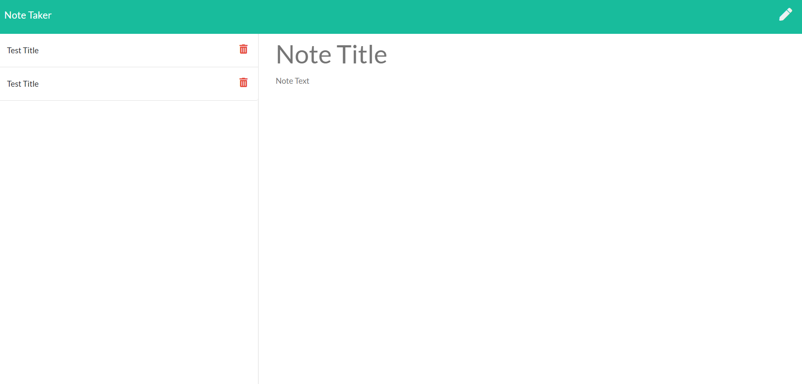

# My Note Taker

## Description 

Write, save, and notes using this express powered app which uses servers to host your application.

## Table of Contents

If your README is very long, add a table of contents to make it easy for users to find what they need.

* [Installation](#installation)
* [Usage](#usage)
* [License](#license)
* [Contributing](#contributing)
* [Tests](#tests)
* [Questions](#questions)

## Installation

Simply type npm i into your command line under your folder which will install path and express into the provided JSON folder.

## Usage 

This is for users that need to keep track of a lot of information. By being able to write persistent notes will allow users to have all of their information available when needed. 

## License

  For more information on the license used, please click on the link below:

- 

## Contributing

UCSD Coding bootcamp TA's and Chris! Thank you for helping me figure out my directory issue!

## Tests 

NONE

## Questions

  For questions concerning my apps, click on the link below for my github:

  [Github Link] (https://github.com/jepoy92)

  Or click the link below for my email:

  [Email] (jeffrey1choi@gmail.com)
